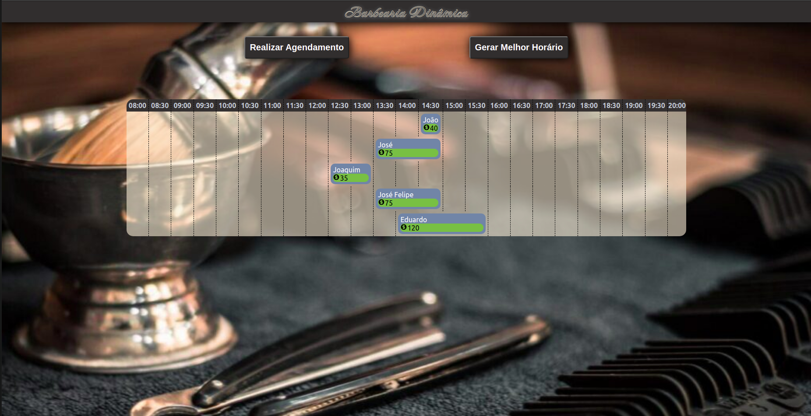
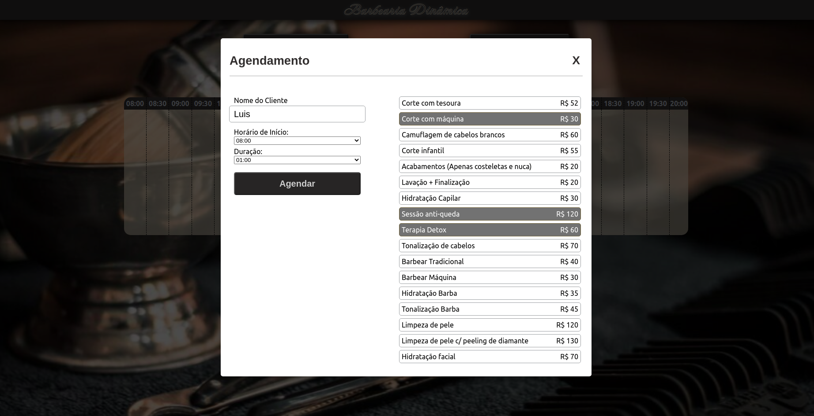
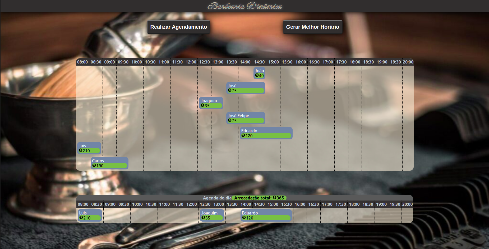

# Barbearia Dinâmica

**Número da Lista**: 5<br>
**Conteúdo da Disciplina**: PD<br>

## Alunos
|Matrícula | Aluno |
| -- | -- |
| 17/0080102  |  Lucas Gomes Lopes |
| 19/0106565  |  Fernando Miranda Calil |

## Sobre 
O projeto visa encontrar, por meio do algoritmo de Weighted Interval Scheduling, o conjunto de agendamentos que dê o maior lucro para uma barbearia.

## Screenshots







## Instalação 
**Linguagem**: Javascript<br>
**Framework**: ReactJS<br>

Siga as instruções a seguir :

1) Clonar o repositório:

```sh 
git clone git@github.com:projeto-de-algoritmos/PD_Barbearia.git
```

2) Acessar a pasta da aplicação React:

```sh 
cd PD_Barbearia
```

3) Instalar as dependências:

```sh 
npm install
```

4) Execute a aplicação:

```sh 
npm start
```
## Uso 
Clique em "Gerar Melhor Horário" para receber o conjunto de serviços com a maior arrecadação.
Clique em "Realizar Agendamento", preencha todos os campos, selecione os serviços desejados e clique em "Agendar" para finalizar o agendamento.


